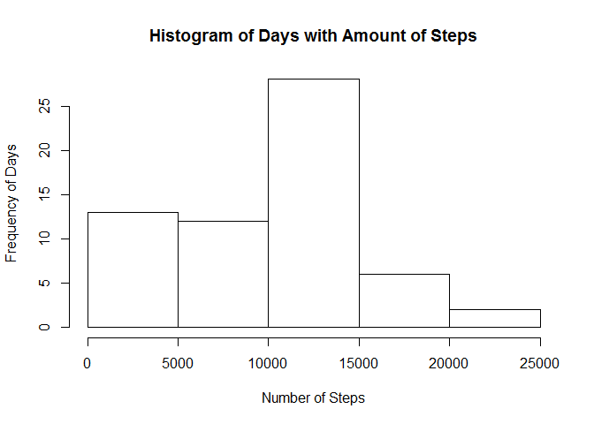
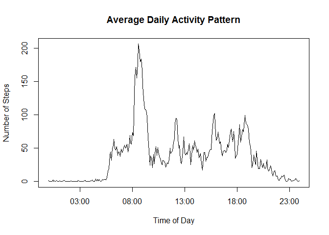
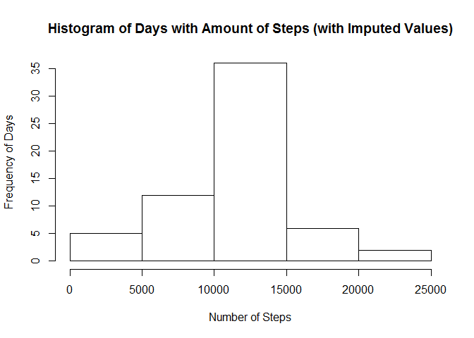
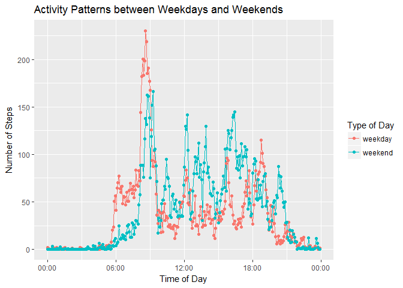

# Reproducible Research: Peer Assessment 1


## Loading and preprocessing the data
The following code reads in the file and transforms the dates into the Date type.

```r
activityData<-read.csv("activity.csv",header=TRUE)
activityData$date<-as.Date(as.character(activityData$date))
activityData$interval<-sprintf("%04d",activityData$interval)
activityData$interval<-as.POSIXct(strptime(activityData$interval,format="%H%M"),format="%H:$M")
```

## What is mean total number of steps taken per day?
The following code sums up the steps recorded per day. The histogram below shows the frequencies of days with certain amount of steps.


```r
activityDataSum<-group_by(activityData,date) %>%
    summarize(sum=sum(steps,na.rm=TRUE))

hist(activityDataSum$sum,main="Histogram of Days with Amount of Steps",xlab="Number of Steps",ylab="Frequency of Days")
```

<!-- -->

The mean and median of the steps taken each day are then calculated. 
 

```r
meanSteps<-mean(activityDataSum$sum)
medianSteps<-median(activityDataSum$sum)
```

The mean of steps taken per day is 9354 and the median of steps taken per day is 10395.


## What is the average daily activity pattern?

The following code calculates the average number of steps taken (averaged across all days) per 5 minute intervals. The resulting averages are then plotted as a time series.


```r
activityDataIntervalAvg<-group_by(activityData,interval) %>%
    summarize(avg=mean(steps,na.rm=TRUE))

plot(activityDataIntervalAvg$interval,activityDataIntervalAvg$avg,type="l",
     main="Average Daily Activity Pattern",xlab="Time of Day",ylab="Number of Steps")
```

<!-- -->

## Imputing missing values

The data set has 2304 NA values. To provide further analysis, we can impute the values from the average daily activity pattern in place of these NA values using the following code:


```r
activityDataImp<-activityData
activityDataImp[is.na(activityData$steps),]$steps<- 
    activityDataIntervalAvg[match(activityData[is.na(activityData$steps),]$interval,
                                  activityDataIntervalAvg$interval),]$avg
```

The following is a histogram of the frequency of days with the imputed values for steps.


```r
activityDataImpSum<-group_by(activityDataImp,date) %>%
    summarize(sum=sum(steps,na.rm=TRUE))

hist(activityDataImpSum$sum,main="Histogram of Days with Amount of Steps (with Imputed Values)",
     xlab="Number of Steps",ylab="Frequency of Days")
```

<!-- -->

## Are there differences in activity patterns between weekdays and weekends?

The following code groups the imputed data by weekday and weekend using the `{r results='hide'}weekdays()` function. The data is then graphed using ggplot2.


```r
activityDataImp$typeOfDay<-ifelse(weekdays(activityDataImp$date) == "Saturday" | 
                                      weekdays(activityDataImp$date) == "Sunday" ,"weekend","weekday")
 
activityDataImpAvg<-group_by(activityDataImp,typeOfDay,interval) %>%
    summarize(avg=mean(steps,na.rm=TRUE))

ggplot(data=activityDataImpAvg,aes(x=interval,y=avg,color=typeOfDay))+
    geom_line(aes(group=typeOfDay))+geom_point() + scale_x_datetime(date_labels="%H:%M") +
    labs(title="Activity Patterns between Weekdays and Weekends",x="Time of Day",y="Number of Steps") +
    scale_color_discrete(name="Type of Day")
```

<!-- -->

Some points about the two graphs:

* There is a large spike around 9:00 during the weekdays. 
* During the weekend, there are more steps taken throughout the day.
* The spikes during the weekend do not exceed the 9:00 spike during the weekdays.
